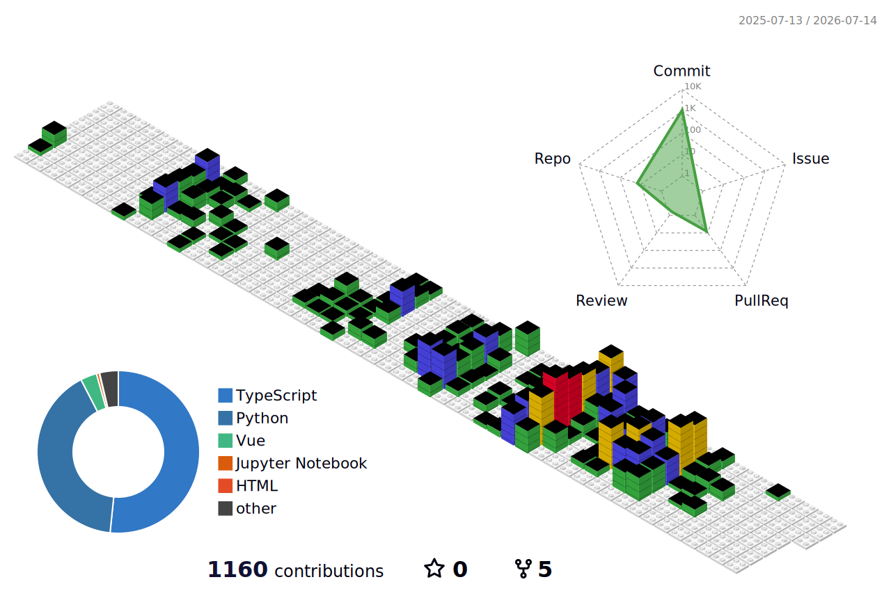

화려한 UI보다 사용자가 길을 잃지 않는 **흐름**과 쉽게 무너지지 않는 **상태 설계**를 먼저 고민하는 프론트엔드 개발자 김혜령입니다.  
기술은 결국 사용자를 위해 존재하지만, 동시에 팀이 함께 이해하고 유지보수해 나가야 하는 자산이라고 생각합니다.  
그래서 기능을 구현하는 데서 멈추지 않고 **왜 이 화면이 필요한지**, 사용자에게 어떤 가치를 주는지, 그리고 백엔드·AI와 더 안정적으로 연결될 수 있는 구조인지까지 함께 고민합니다.  

---

## ⚙️ Projects

**🧩 [P2U](https://github.com/hyeryeongeda/p2u_project) : AI 기반 P&ID 도면 분석 결과 검토 데스크톱 애플리케이션**  
> Current Project · Private Repository
C# WPF 기반으로 산업용 도면 분석 결과를 사용자가 확인하고 검토할 수 있는 UI를 구현하는 프로젝트입니다.  
도면 업로드, 분석 진행, 결과 검토, 객체 상세 확인 흐름을 중심으로 AI 결과를 화면에 구조화하고 있습니다.

**👀 [EyeSpeak](https://github.com/hyeryeongeda/eyespeak) : 시선 입력 기반 ALS 환자 보조 의사소통 서비스**  
손 사용이 어려운 환자가 시선 입력으로 의사 표현, 보호자 호출, 여가 기능을 사용할 수 있도록 지원하는 서비스입니다.  
환자모드 UI, 2×3 시선 입력 그리드, 전역 메뉴, 선택 피드백, AI-FE 연동 구조를 담당했습니다.

**🎨 [ARNNECT](https://github.com/hyeryeongeda/ARNNECT) : 신진 예술가와 사용자를 연결하는 예술 큐레이션 플랫폼**  
작품 탐색, 리뷰, 댓글, 팔로우, 팬레터, 티켓/컬렉트북, 3D 전시관을 제공하는 예술 플랫폼입니다.  
역할 기반 라우팅, JWT 인증 흐름, 주요 API 연동, Three.js 기반 3D 전시관 구현을 담당했습니다.

---

## 🏆 Awards & Certifications

🥇 **SSAFY 특화 프로젝트 최종 발표 1등 수상**  
&nbsp;&nbsp;&nbsp;&nbsp;EyeSpeak / Frontend

🧠 **삼성 SW 역량테스트 IM 등급**

📜 **정보처리기사**

📊 **SQLD**

---

## 🛠 Skills

  

| Category | Tech Stack |
| :--- | :---: |
| **Language** |    |
| **Frontend** |     |
| **Desktop** |   |
| **API / Realtime** |     |
| **UI / Visualization** |    |
| **Collaboration** |     |
| **Additional Experience** |    |

---

## 🎓 Education & Activity

| 교육기관 및 활동 내용 | 기간 | 비고 |
|---|---:|---|
| **SSAFY 14기** | 2025.07 ~ 2026.06 | EyeSpeak 특화 프로젝트 최종 발표 1등 |
| **KT AIVLE School 5기** | 2024.02 ~ 2024.08 | AI·소프트웨어 개발 집중 교육 과정 |
| **울산대학교** | 2020.03 ~ 2024.02 | 프랑스어 전공 / IT공학 복수전공 |

---

## 📝 Technical Writing

개발 과정에서 마주한 문제 해결, 프로젝트 회고, 협업 자동화 경험을 기록합니다.

<!-- BLOG-POST-LIST:START -->
- [트러블슈팅 기록? 까먹기 전에 자동으로 줍줍하게 만들기](https://premiereneige.tistory.com/29)
- [n8n + Gemini API로 GitLab MR 자동 리뷰봇 만들기: 503 high demand 에러를 시간대별 분기로 우회한 기록](https://premiereneige.tistory.com/27)
- [자율프로젝트인데요?](https://premiereneige.tistory.com/26)
<!-- BLOG-POST-LIST:END -->

[전체 글 보러가기](https://premiereneige.tistory.com/)

---

## 📊 GitHub Activity

---

## 📬 Contact

---

사용자에게는 자연스러운 흐름을, 팀에게는 이해하기 쉬운 구조를 만드는 프론트엔드 개발자로 성장하고 있습니다.

